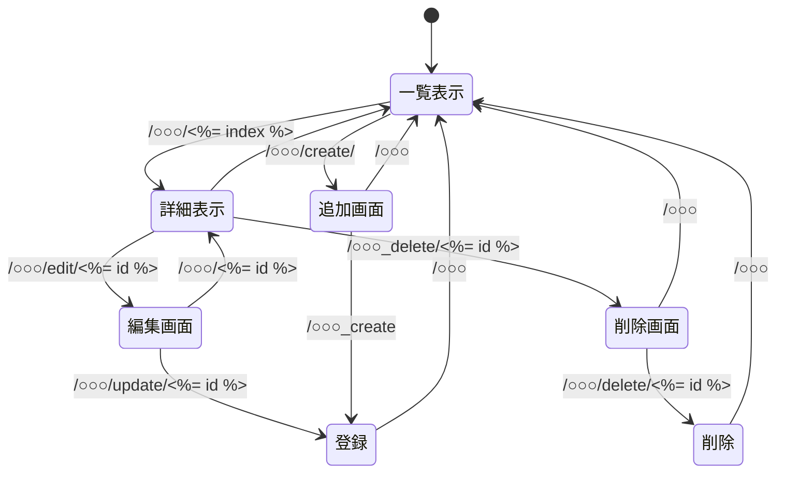

# 開発用使用書（仮）

##　対象とするシステム

- 黄金裔一覧システム
- 聖遺物効果，(おすすめキャラ)一覧
- 鳴潮限定星５所持キャラ一覧

## データ構造

####　黄金裔一覧システムのデータ構造
項目名 | 型 | 内容
-|-|-
id | 数値 | キャラID
code | 文字列 | キャラクターデータ名
name | 文字列 | キャラクター名
spark | 文字列 | 背負った火種
divine | 文字列 | 担う神権

#### 聖遺物の効果，おすすめキャラ一覧システムのデータ構造
項目名 | 型 | 内容
-|-|-
id | 数値 | 聖遺物ID
name | 文字列 | 聖遺物名
two_set | 文字列 | ２セット効果
five_set | 文字列 | ５セット効果
chara | 文字列 | おすすめキャラ

※余力があればおすすめ度も表示したい

#### 鳴潮限定星５所持キャラ
項目名 | 型 | 内容
-|-|-
id | 数値 | キャラID
name | 文字列 | キャラ名
weapon | 文字列 | 武器名
chain | 数値 | 凸数
sound | 文字列 | 装備音骸
H | 数値 | HP
A | 数値 | 攻撃力
B | 数値 | 防御力
C_H | 数値 | クリティカル
C_D | 数値 | クリダメ
charge | 数値 | 共鳴効率
effect | 数値 | 属性ダメバフ
usual | 数値 | 通常
skill | 数値 | スキル
circuit | 数値 | 共鳴回路
release | 数値 | 共鳴解放
variation | 数値 | 変奏

## ページ構造

#### 黄金裔一覧システムのページ構造
1. 一覧ページ 
- キャラID，キャラクターデータ名，キャラクター名を表示，
- 追加ボタン，詳細ボタン（キャラクター名）

2. 詳細ページ
- キャラクターID，キャラクターデータ名，キャラクター名，背負った火種，担う神権を表示
- 編集ボタン，削除ボタン

3. 編集ページ
- キャラクターID，キャラクターデータ名，キャラクター名，背負った火種，担う神権を表示
- 決定ボタン，詳細に戻るボタン

4. 削除ページ
- キャラクターID，キャラクターデータ名，キャラクター名，背負った火種，担う神権を表示
- 決定ボタン，詳細に戻るボタン

5. 追加ページ
- キャラクターID，キャラクターデータ名，キャラクター名，背負った火種，担う神権を表示
- 決定ボタン，一覧に戻るボタン

##### 以降は黄金裔システムを参照してネ
##### 書くのがめんどくさい

## ページ遷移
#### 黄金裔一覧システムのページ遷移
