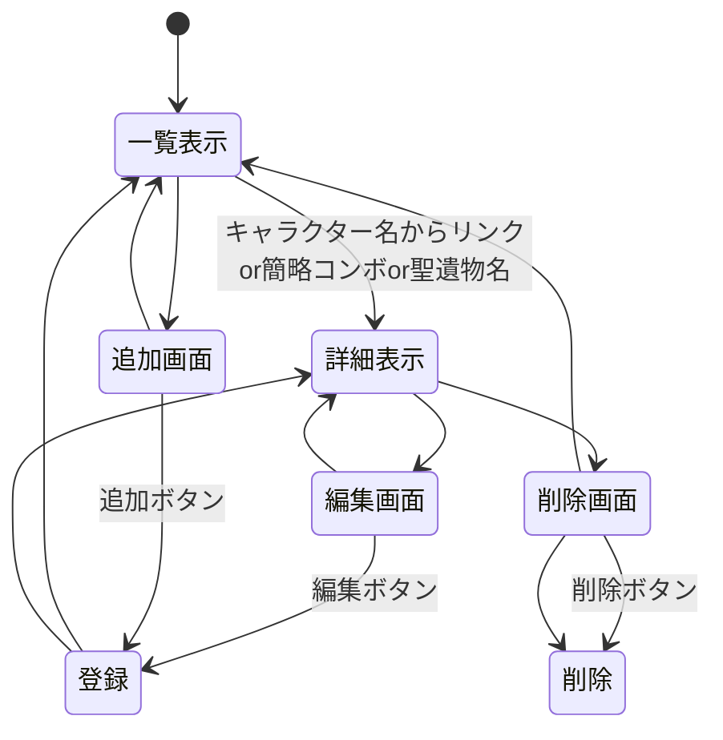

# 開発用使用書（仮）

##　対象とするシステム

- 黄金裔一覧システム
- マーヴィカコンボ一覧
- 聖遺物効果，(おすすめキャラクター)一覧

## データ構造

####　黄金裔一覧システムのデータ構造
項目名 | 型 | 内容
-|-|-
id | 数値 | キャラID
code | 文字列 | キャラクターデータ名
name | 文字列 | キャラクター名
spark | 文字列 | 背負った火種
divine | 文字列 | 担う神権

#### マーヴィカコンボ一覧システムのデータ構造
項目名 | 型 | 内容
-|-|-
id | 数値 | コンボID
date | 文字列 | 発見された日
name1 | 文字列 | 簡略コンボ名
name2 | 文字列 | 日本語のコンボ名
point | 文字列 | コツなど

#### 聖遺物の効果，おすすめキャラ一覧システムのデータ構造
項目名 | 型 | 内容
-|-|-
id | 数値 | 聖遺物ID
name | 文字列 | 聖遺物名
2set | 文字列 | ２セット効果
5set | 文字列 | ５セット効果
chara | 文字列 | おすすめキャラ

※余力があればおすすめ度も表示したい

## ページ構造

#### 黄金裔一覧システムのページ構造
1. 一覧ページ 
- キャラID，キャラクターデータ名，キャラクター名を表示，
- 追加ボタン，詳細ボタン（キャラクター名）

2. 詳細ページ
- キャラクターID，キャラクターデータ名，キャラクター名，背負った火種，担う神権を表示
- 編集ボタン，削除ボタン

3. 編集ページ
- キャラクターID，キャラクターデータ名，キャラクター名，背負った火種，担う神権を表示
- 決定ボタン，詳細に戻るボタン

4. 削除ページ
- キャラクターID，キャラクターデータ名，キャラクター名，背負った火種，担う神権を表示
- 決定ボタン，詳細に戻るボタン

5. 追加ページ
- キャラクターID，キャラクターデータ名，キャラクター名，背負った火種，担う神権を表示
- 決定ボタン，一覧に戻るボタン

#### マーヴィカコンボ一覧システムのページ構造
1. 一覧ページ
- コンボID，発見された日，簡略コンボ名
- 追加ボタン，詳細ボタン（簡略コンボ名）

1.詳細ページ
- コンボID，発見された日，簡略コンボ名，日本語コンボ名，コツなど
- 編集ボタン，削除ボタン

以降は黄金裔システムを参照してネ
書くのがめんどくさい

## ページ遷移
#### 黄金裔一覧システムのページ遷移
